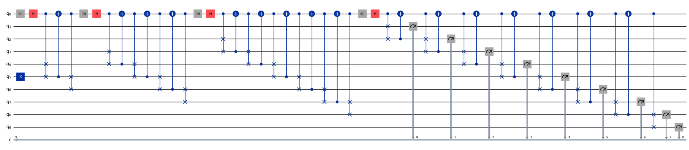

# Quantum Walks for Monte Carlo Simulation

**From Pegs to Qubits: A Quantum Take on the Classic Galton Board**

This repository contains the implementation, analysis, and results of our project on **Quantum Galton Boards (QGBs)** as *Universal Statistical Simulators*, extending the framework proposed by [Carney & Varcoe (2022)](https://arxiv.org/abs/2202.01735). We design scalable quantum circuits capable of generating **Gaussian**, **Exponential**, and **Hadamard-walk** distributions via discrete-time quantum walks, and optimize them for **Noisy Intermediate-Scale Quantum (NISQ)** hardware.

## Key Features
- **Depth-Optimized Circuits:** ≤ 76 gates for a 4-layer QGB (over 2× improvement vs. reference implementations).
- **N-Layer Implementations:** Scalable circuit designs for both **biased** and **unbiased** QGBs, as well as a general **Hadamard quantum walk**.  
- **Bias Control:** Tunable parameters to produce non-uniform distributions.   
- **Bias Control:** Tunable parameters to produce non-uniform distributions.  
- **Noise Mitigation:** Hardware-aware transpilation, gate cancellation, and zero-noise extrapolation.  
- **Multi-Metric Validation:** Fidelity, Wasserstein distance, Kolmogorov–Smirnov statistics.

## Example Quantum Circuit
This is the 4-layer unbiased QGB circuit generated using the n-layer function:

## Performance Highlights
- **Gaussian fidelity:** ≈ 86%  
- **Exponential fidelity:** ≈ 93%  
- **Hadamard-walk fidelity:** ≈ 95%  
- All above **80% fidelity** under realistic IBM-Q noise models after mitigation.

## Repository Contents
- **`notebooks/`** – Two Jupyter notebooks with full circuit construction, NISQ simulation, and analysis.  
- **`report.pdf`** – Full technical report with theoretical background, methodology, and results.
- **`images/`** – Circuit diagrams 
- **`src/`** – Core Python implementations for QGB construction, noise analysis and post-processing.

## References
See full reference list in `report.pdf`.

## License
MIT License — check `LICENSE` file.
